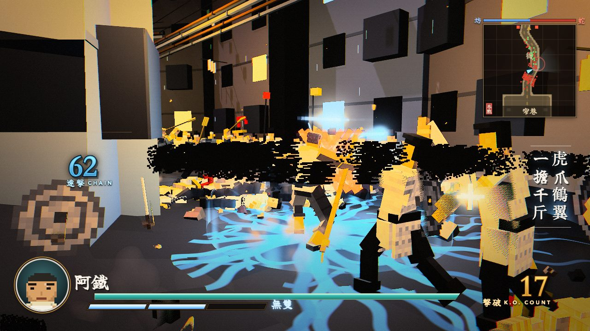
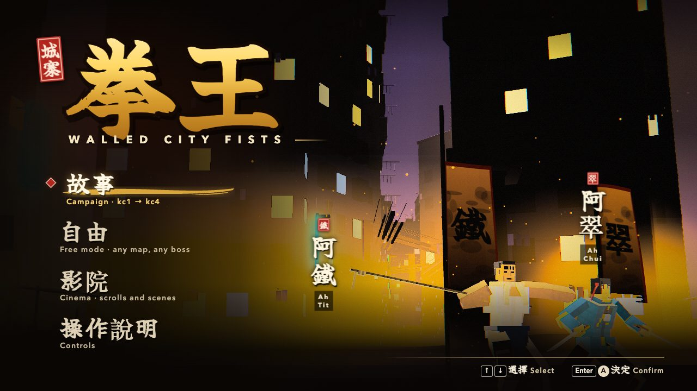
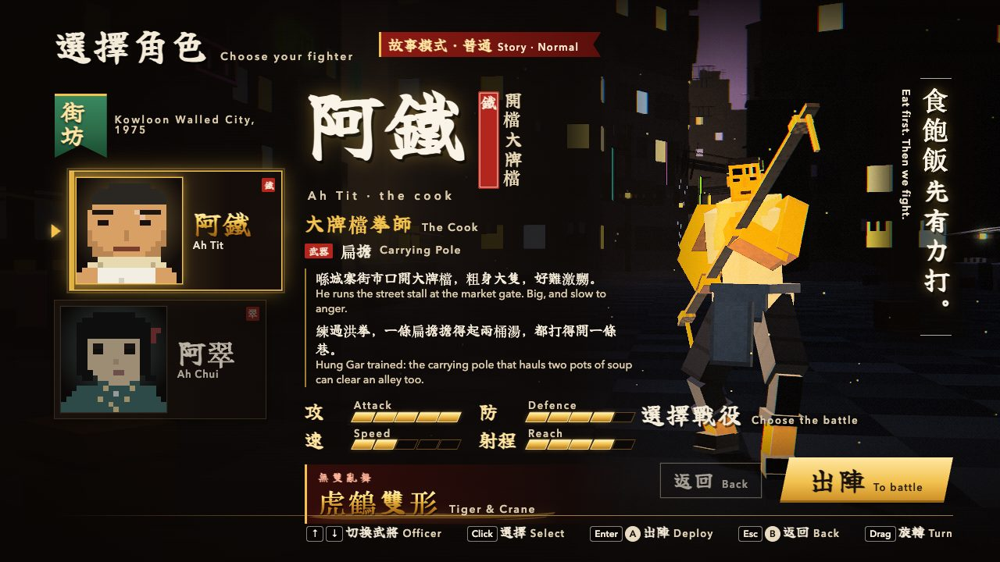
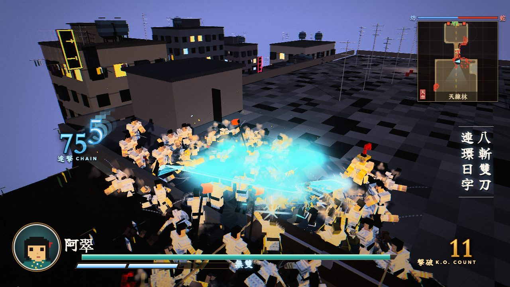
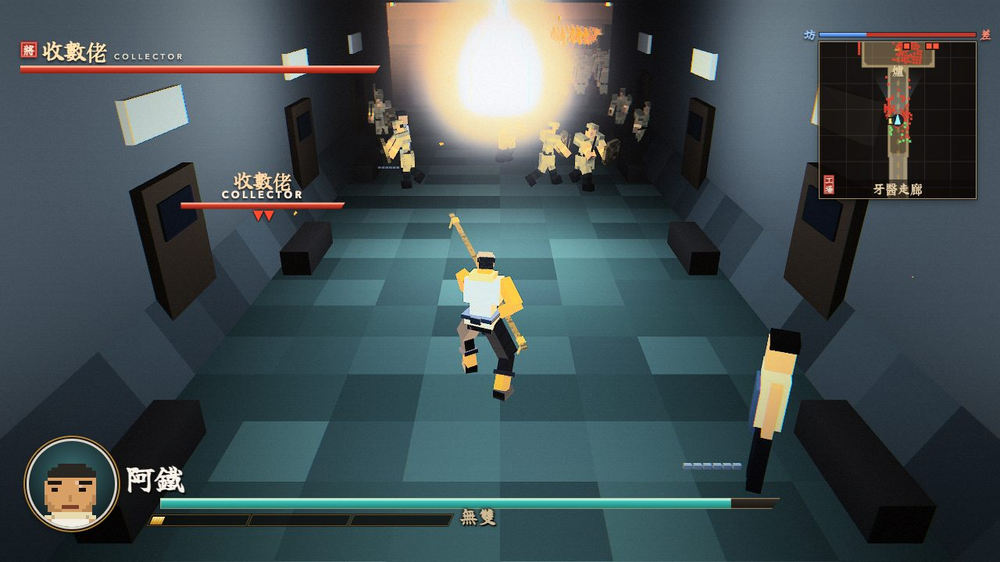
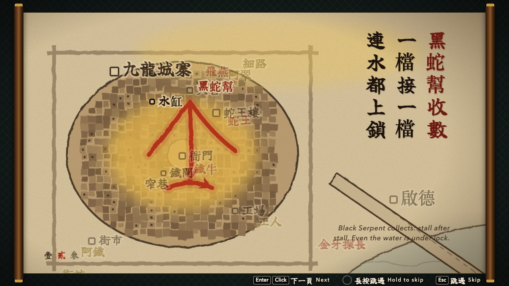
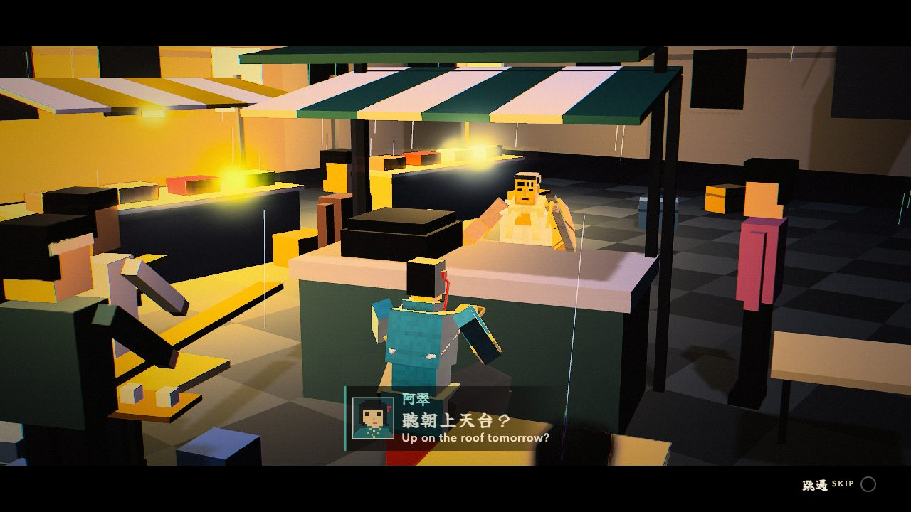
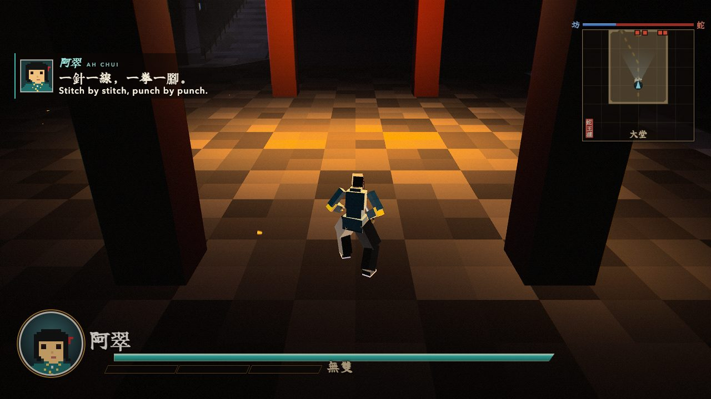
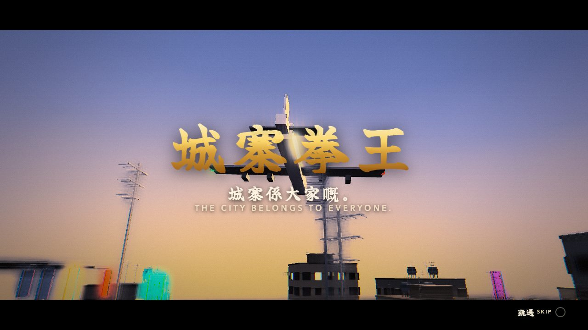
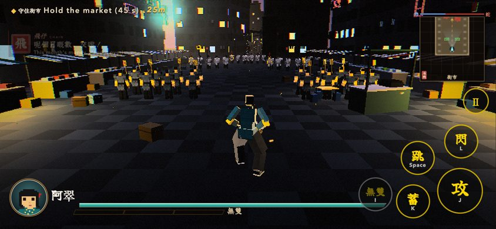

# 城寨拳王 Walled City Fists · Voxel

<p align="center"><a href="https://walled-city-fists.vercel.app"></a></p>

<p align="center"><b><a href="https://walled-city-fists.vercel.app">▶ Play in your browser — walled-city-fists.vercel.app</a></b> · desktop or phone (landscape)</p>

| | |
| --- | --- |
|  |  |
| 故事 · 自由 · 影院 on the title menu | 阿鐵 the cook or 阿翠 the seamstress |
|  |  |
| Ch. II 天台 — 阿翠's Eight Cuts across the roofs | Ch. III 工場 — the dentists' corridor |
|  |  |
| Ink hand-scroll prologues on a map of the city | Between-chapter scenes: the stall opens again |
|  |  |
| Ch. IV 蛇王樓 — the Serpent Tower's lobby | The end scene: 城寨係大家嘅 |

An original kung fu musou set in a fictional 1975 九龍城寨. Thirty-three thousand people in six and a half acres, no
law, and one gang — 黑蛇幫 Black Serpent — on top: protection money on every stall, the water tanks padlocked. Two
neighbours who know kung fu take the city back, floor by floor, from the alleys up to the Serpent King's roof. The
Walled City is a real place; every character, gang and event here is fictional.

- **Fighters** — 阿鐵 Ah Tit, the cook (洪拳 + 扁擔 carrying pole: wide sweeps, a tiger-claw grab and throw, the crane
  leap; Musou 虎鶴雙形 Tiger & Crane) and 阿翠 Ah Chui, the seamstress (詠春 + 八斬刀 butterfly swords on the dual-wield
  rig: alternating cuts, chain punches with the blades tucked back; Musou 八斬連環 Eight Cuts).
- **Chapters** — 第一章 巷戰 The Alleys (the wet market, the lane under dripping pipes, the gang's iron gate, the old
  衙門 and 鐵牛 Iron Ox) · 第二章 天台 The Rooftops (the dawn class's escort, plank bridges under low jets, the padlocked
  water tanks, 飛燕 Swallow) · 第三章 工場 The Factories (chained workers freed floor by floor, a power cut, 金牙探長
  Gold-Tooth) · 第四章 蛇王樓 The Serpent Tower (the whole city marches, neighbours drop pots from the balconies, 蛇王 the
  Serpent King in four phases, then the ENDING scroll and the end scene).
- **Modes** — 故事 Campaign (chapters unlock in order, prologue scroll → battle → epilogue → between-chapter scene →
  next chapter; 繼續 / 新遊戲) · 自由 Free mode (any fighter × map × difficulty × enemy count × boss, endless waves) ·
  影院 Cinema (every scroll and scene).
- Written Cantonese + English throughout; procedural sound (an original pentatonic kung fu theme, the market's
  clatter and mahjong tiles, dripping pipes, rain on tin, jets roaring low with their Doppler). Plays on phones:
  floating stick, 攻 蓄 跳 閃 無雙 buttons, a lighter mobile quality tier.

<p align="center"></p>

Plain ES modules, Three.js r186 vendored, deterministic fixed 60 Hz simulation, no build step. Copied from
[icomppower/hk-freedom-voxel](https://github.com/icomppower/hk-freedom-voxel) (touch controls, mobile tier, harness,
registries, dual-wield rig, crowd skins, bot), which builds on [icomppower/sheep-village](https://github.com/icomppower/sheep-village)
and [mike007jd/voxel-musou](https://github.com/mike007jd/voxel-musou). Upstream's 定軍山 chapter stays in the repo behind
`?dev` as the determinism gate.

## Run

ES modules don't load from `file://`, so serve the folder with any static server:

```sh
python3 -m http.server 8000
```

Then open http://localhost:8000 (WebGL2). `?hq` forces full quality on a phone; `?dev` shows the upstream 定軍山 chapter
and officers. Deep links: `?go=free&char=tit|chui&map=alleys|rooftops|factories|tower&boss=ox|swallow|goldtooth|serpent`
(a boss straight away), `?go=cut&id=kc1…kc4|between1…3|ending|end` (a scroll or scene).

## Controls

| Action | Keys | Gamepad | Touch |
| --- | --- | --- | --- |
| Move (camera-relative) | WASD / arrow keys | left stick | floating stick (left half) |
| Attack | J / left click | X □ | 攻 |
| Charge | K / right click (mid-combo) | Y △ | 蓄 |
| Jump | Space | A × | 跳 |
| Dodge | L / Shift | R1 R2 | 閃 |
| Musou (gauge full) | I | B ○ | 無雙 (lit when ready) |
| Camera | mouse (click the field to lock it) / Q E | right stick | drag on the right half |
| Recenter / face nearest officer | R | L1 L2 | — |
| Pause | Esc | | Ⅱ |
| Skip a scroll / scene | Esc, or hold Enter | | tap / 跳過 |

## Tests

`sh bench/verify.sh` runs every gate: the upstream chapter's state hashes (Node + headless Chrome), rig and dual-wield
probes, both fighters' move / Musou gates, the four bosses' phase gates as both fighters, a map gate and a bot that
must win every chapter as both fighters in three play styles, scroll checks, result cards, the cutscenes, the three
modes (a bot campaign kc1 → kc4, every free-mode map × fighter × boss, the gallery), the sound (peaks, the skip fade),
the touch hook and a phone tap-through, and frame time on desktop and on an emulated phone with a 4× CPU throttle.
`--quick` skips the Chrome half. Build log: `PROGRESS.md`; screenshots per stage: `bench/shots/`.

## Credits & License

- Engine and original game: [mike007jd/voxel-musou](https://github.com/mike007jd/voxel-musou) by BubuAi — MIT, see
  [LICENSE](LICENSE). Engine hooks from [icomppower/sheep-village](https://github.com/icomppower/sheep-village) and
  [icomppower/hk-freedom-voxel](https://github.com/icomppower/hk-freedom-voxel) (MIT). The 城寨拳王 content is added on
  top under the same license.
- [three.js](https://threejs.org/) r186 — MIT.
- Fallback brush font `src/ui/brush.woff2`: a subset of Yuji Boku by Kinuta Font Factory, SIL Open Font License 1.1.
  macOS system fonts (Xingkai SC, Kaiti SC) are used when present.
- Music and sound are synthesised in the browser at load; no recordings or existing songs.

All characters, gangs and events are fictional; the place is real. Nothing here is taken from any existing Walled City
novel, film or game. Fan project, not affiliated with or endorsed by KOEI TECMO; no assets from any commercial game are
included.
